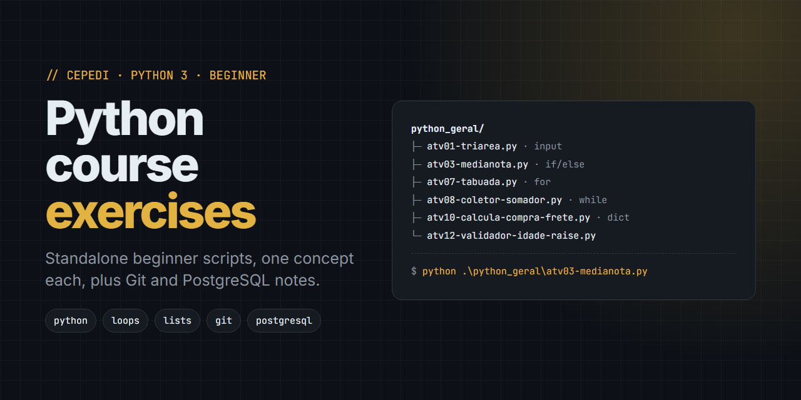

# CEPEDI Python Course: beginner Python exercises, Git and PostgreSQL notes



**`curso-python-cepedi`** is a collection of small, standalone Python 3 exercise scripts written during the CEPEDI Python course, plus Portuguese study notes on Git and on running PostgreSQL with pgAdmin on Windows, for beginners learning programming fundamentals.

Each script in `python_geral/` is one independent exercise with a docstring header that explains what it does and which concepts it practices. The code comments and the program output are in Portuguese.

> Python exercises for beginners · Python basics · input and output · if/else · for and while loops · lists · dictionaries · functions · try/except · Git cheat sheet · PostgreSQL on Windows · pgAdmin

[](https://github.com/WednyFernandes/curso-python-cepedi)
[](https://github.com/WednyFernandes/curso-python-cepedi/commits)

---

## What's inside

- **Standalone exercises** (`.py` scripts) covering the basics: input and output, arithmetic, conditionals, loops, lists, dictionaries, functions and exception handling.
- **Small utilities and drafts** used during the classes.
- **Study notes** (Portuguese): a Git quick guide and a PostgreSQL-on-Windows guide.

## Exercises

Numbered course activities (`atv`) in `python_geral/`:

| File | What it does | Concepts |
|---|---|---|
| `atv01-triarea.py` | Triangle area from base and height | input, arithmetic |
| `atv02-ehpar.py` | Checks if a number is greater than 10 and if a sum is even or odd | conditionals, modulo |
| `atv03-medianota.py` | Average of three grades (0–10), then pass / make-up exam / fail | validation, conditionals |
| `atv04-triangulo-tipador.py` | Classifies a triangle as equilateral, isosceles or scalene | conditionals |
| `atv05-login-senha-tester.py` | Login with up to 3 password attempts | while loop, counters |
| `atv06-soma-pares.py` | Sums every even number from 1 to N | for loop |
| `atv07-tabuada.py` | Multiplication tables for a range of numbers | nested for loops |
| `atv08-coletor-somador.py` | Collects numbers until a stop value, then sums them | lists, while loop |
| `atv10-calcula-compra-frete.py` | Product price plus shipping by delivery region | dictionaries |
| `atv11-gera-codigo-produto.py` | Builds a product code from its name and year | string slicing |
| `atv12-validador-idade-raise.py` | Validates an age and rejects zero or negative values | try/except, raise |

Other practice scripts in the same folder:

| File | What it does |
|---|---|
| `first.py` | Hello World |
| `roboed.py` | "Ed" the robot greets you by name and city |
| `ifelse.py`, `idadevsvalor.py`, `checaIdade.py` | Age checks with if/else and boolean comparisons |
| `contadorwhile.py`, `numerosprimos.py` | while counter and prime numbers in a range |
| `calculator.py` | Text calculator for input like `2+3` |
| `calculaImposto.py` | Tax amount on a sale, using a function |
| `boletimMedia.py`, `filtraVenda.py`, `manipulacaoEstoque.py` | List slicing, filtering and `append` |
| `limpaInput.py` | Cleans name and email with `strip`, `upper`, `lower`, `replace` |
| `montadorUrl.py` | Joins user-typed path segments into a URL |
| `banco.py` | Simple bank login against a list of users |
| `tryDivision.py`, `rascunho.py` | `ZeroDivisionError` handling and a custom exception class |
| `testetime.py`, `teste.py` | Timing code with `time.time()` and a scratch test file |

## Study notes

| File | Topics |
|---|---|
| [`github/GIT-APRENDIZADO.md`](github/GIT-APRENDIZADO.md) | Git quick guide: config, init and clone, add/commit/log, branches, remotes, undoing changes, stash, tags, `.gitignore`, good practices |
| [`postgresql/postgresql-basico.md`](postgresql/postgresql-basico.md) | PostgreSQL on Windows: install (official installer or Chocolatey), start/stop the service, `psql` meta-commands, users and databases, basic SQL, `pg_dump`/`pg_restore`, pgAdmin, security tips |

## Getting started

**Prerequisites:** Python 3.8+ (3.10 or 3.11 recommended). Git is optional, for cloning.

1. Clone the repository:

```powershell
git clone https://github.com/WednyFernandes/curso-python-cepedi.git
cd curso-python-cepedi
```

2. Run any exercise (Windows / PowerShell):

```powershell
python .\python_geral\atv03-medianota.py
```

No dependencies to install. Every script uses only the Python standard library.

## Project structure

```
curso-python-cepedi/
├── python_geral/   # standalone exercise scripts (atv01–atv12 and others)
├── python_poo/     # placeholder for object-oriented programming exercises
├── github/         # Git quick guide (Portuguese)
└── postgresql/     # PostgreSQL + pgAdmin on Windows guide (Portuguese)
```

## FAQ

**Is this a full Python course?**
No. It's the exercise folder from the CEPEDI course: short scripts, one concept each, meant for teaching and practice.

**Why is the code in Portuguese?**
The course was taught in Portuguese, so variable names, comments, prompts and the study notes are in Portuguese.

**Do the scripts depend on each other?**
No. Each file in `python_geral/` is independent. Read its docstring header for what it does, then run it directly.

## Contact

Maintained by [Wedny Fernandes](https://github.com/WednyFernandes).
